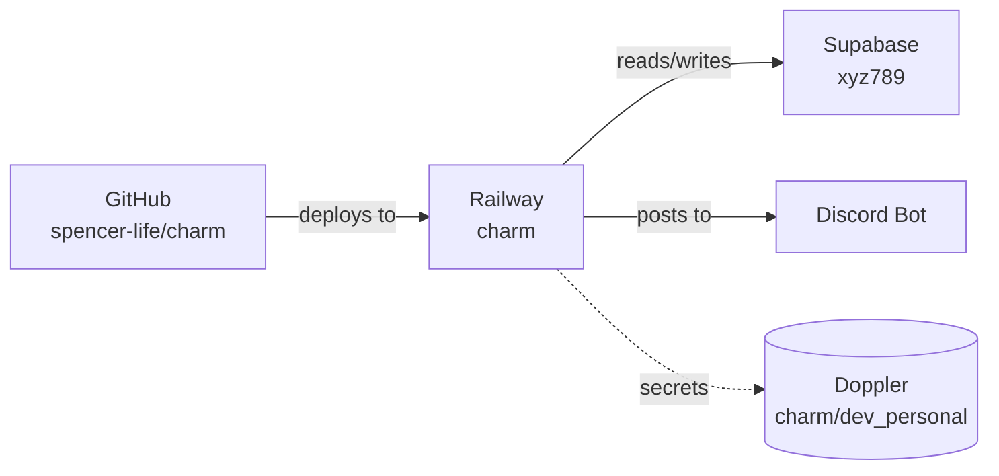

# flintflow

A Claude Code plugin for structured project workflows: visual service mapping,
ground-truth data verification, session lifecycle management, and multi-stage
subagent execution.

## The Problem

Claude Code is great at writing code, but complex projects — especially
database-backed ones — have recurring pain points:

- **Claude grades its own homework.** Tests pass, but the data is wrong because
  Claude wrote both the code and the tests.
- **Context evaporates between sessions.** Handoff files help, but there's no
  persistent project memory across many sessions.
- **"Done" doesn't mean correct.** Claude declares victory after tests pass,
  but nobody verified the actual database values.
- **No at-a-glance project map.** Coming back to a project, there's no single
  view of what services it touches (Supabase ref, Railway project, Netlify
  site, Doppler scope) without clicking through configs.
- **Project setup feels like data entry.** Old-school scaffolds leave
  `FILL_IN` placeholders the user has to open and edit by hand.

flintflow fixes these with auto-detected visual service maps, zero-placeholder
project scaffolding, ground-truth verification, persistent project state, and
a structured execution pipeline.

## What's Inside

### Skills (12)

| Skill | Description |
|-------|-------------|
| `/design` | Idea-to-implementation pipeline. Interviews you about the project, designs architecture, generates a plan, and auto-transitions to `/project-init` + SDD. Entry point for new features. |
| `/project-init` | Strategic interview that auto-detects services first, then asks about purpose, status, and direction. Generates `PROJECT_STATE.md` (always), `PROJECT_MAP.md` (always), `VERIFICATION.md` + queries (only if data-backed), `smoke_test.sh` (only if deployed). **Zero placeholders** — every value comes from auto-detection or a conversational answer. |
| `/project-map` | Generate or refresh a visual `PROJECT_MAP.md` at the project root: Mermaid service flowchart + inventory table with dashboard URLs. Auto-detects from project files (package.json, railway.toml, supabase/, .env.example, Python deps) and cross-references the user's global service-map memory for canonical IDs. Idempotent re-runs preserve hand-edited content. |
| `/data-verify` | Runs ground-truth verification against your database. Compares actual values to human-authored expected values in `VERIFICATION.md`. Refuses to generate its own expected values. |
| `/handoff` | Enhanced context transfer with data-state section. Gathers from conversation, git, and database state. |
| `/catchup` | Resume from a handoff. Reads `PROJECT_STATE.md` + `VERIFICATION.md`, flags data failures, suggests fixes before proceeding. |
| `/status` | Project confidence dashboard. Runs 5 signals (tests, lint, data, smoke, git) and outputs a score. Fires automatically mid-session and before wrap-up. |
| `/wrap-up` | End-of-session checklist: verify data → commit (never push) → update project state → capture learnings → review. |
| `/codex` | Codex CLI (GPT-5.4) integration. Subcommands: exec, review, adversarial-review, research, compare, status, cancel, result. Structured adversarial review with JSON output, background job management, and cross-model verification at phase boundaries. |
| `/subagent-driven-development` | Full execution pipeline: Pre-flight → Implement (TDD) → Spec Review → Code Quality → Data Verify → Smoke Test → Codex Auto-Review. TDD, simplification, and verification are built in. All subagent prompts embedded. |
| `/add-logging` | Audit a deployed service for error-logging gaps and add missing handlers. Covers Node/Discord/Express/Next.js/Supabase Edge/Python. Flags `process.on('unhandledRejection')`, `client.on('error')`, missing try/catch wraps. |
| `/log-to-gh` | Persist the current TaskList (or a plan summary) to a GitHub issue in the current repo. Uses the `gh-issue-logger` haiku subagent for the actual creation. |

### Agents (5)

| Agent | Description |
|-------|-------------|
| `pre-flight` | Checks scope conflicts, missing context, data safety, and dependencies before implementation starts. |
| `data-verifier` | Verifies database values against `VERIFICATION.md` ground-truth. Verdicts: APPROVED, REJECTED, INCONCLUSIVE, BLOCKED. |
| `integration-reviewer` | Reviews branch merges after parallel sessions. Checks git conflicts, logic conflicts, data conflicts, and schema conflicts. |
| `docs-reader` | Reads Claude Code docs via `claude-docs-helper.sh` in isolated context, returns only the sections relevant to the caller's question. Keeps verbose raw docs out of main context. |
| `gh-issue-logger` | Creates a well-formatted GitHub issue from a task list and returns the URL. Narrow, deterministic — never edits files. |

### Hooks

Hooks live in `plugin/hooks/` and fire on PostToolUse, PreToolUse,
SubagentStart, SubagentStop, and UserPromptSubmit events. They handle:

| Hook | Purpose |
|---|---|
| `data-verify-nudge.sh` | Reminds to run `/data-verify` after DB changes |
| `docs-reader-marker-start.sh` / `-stop.sh` | Wraps docs-reader subagent invocations to keep verbose docs out of main context |
| `docs-redirect-gate.sh` | Routes Claude Code questions to local docs mirror instead of guessing |
| `logging-nudge.sh` | Nudges `/add-logging` when editing deployed-service files lacking error handlers |
| `pr-security-gate.sh` | Pre-commit security scan when PR is being prepared |
| `sbdd-nudge.sh` | Suggests `/subagent-driven-development` for multi-step implementation tasks |
| `security-review-marker.sh` | Marks security-sensitive subagent runs |
| `wrapup-nudge.sh` | Suggests `/wrap-up` at end of work session with uncommitted code |

### Scripts

| Script | Description |
|--------|-------------|
| `codex-delegate.sh` | Bash wrapper for Codex CLI with subcommands (exec, review, adversarial-review, research, compare, status, cancel, result), timeout handling, git worktree support, background job management, and post-write lint/format integration. |
| `adversarial-review-schema.json` | JSON schema for structured adversarial review output (verdict, findings with severity/confidence/file/line). |
| `adversarial-review-prompt.txt` | System prompt template for adversarial code review via Codex. |

## Optional Codex Verifier Layer

flintflow works without any Codex-specific local skills, but the recommended
setup is to pair flintflow with a small read-only Codex verifier pack:

- `claude-work-verifier` — independent task review with `BLOCK`, `FIX`, or `SHIP`
- `artifact-verifier` — evidence-first verification for UI/API/data/browser work
- `handoff-auditor` — stale-context and drift check before resuming from handoff
- `ground-truth-coverage` — audit `VERIFICATION.md` coverage without inventing values

These are invoked through the same wrapper and `just` shortcuts used by the
`/codex` skill. Codex stays read-only by default; Claude remains the executor.

## Key Concepts

### Zero-placeholder principle

`/project-init` never leaves the user to open a file and fill in slots. Every
value in every generated file (`PROJECT_STATE.md`, `PROJECT_MAP.md`,
`VERIFICATION.md`, `smoke_test.sh`) comes from either:

1. **Auto-detection** (git remote, package.json, railway.toml, supabase/, env
   examples, dependency files), OR
2. **A conversational answer** captured during the strategic interview.

If a value isn't known yet (e.g., a verification category with no ground-truth
values), that section is OMITTED — never stubbed with `FILL_IN`.

### PROJECT_MAP.md

A visual at-a-glance map of every external service the project touches.
Mermaid flowchart (renders inline in Claude chat AND VS Code markdown
preview) plus an inventory table with dashboard URLs. Generated by
`/project-init` and refreshable any time via `/project-map`.



### VERIFICATION.md

A human-authored file of expected values. Claude and Codex are both forbidden
from generating these — only humans establish ground truth.

```markdown
## Premium Rates
| Carrier | Product | Age | Gender | Tobacco | Expected |
|---------|---------|-----|--------|---------|----------|
| PL | IUL | 45 | M | NS | $247.50 |
| ANICO | FE | 55 | - | NS | $32.50 |
```

In the redesigned `/project-init`, these values are captured CONVERSATIONALLY
during the interview — never as placeholders the user must fill in later.

### PROJECT_STATE.md

Persistent project memory that survives across sessions. Tracks architecture
decisions, data accuracy scores, active work streams, parallel session
boundaries, and known issues.

### The Pipeline

```
Pre-flight → Implement → Spec Review → Code Quality → Data Verify → Codex Review
```

Every stage has a clear verdict. Any REJECTED verdict blocks progression. Data
verification uses `VERIFICATION.md` — not AI-generated expectations.

## Installation

flintflow ships as a Claude Code plugin via the marketplace mechanism.

```bash
# Add the marketplace (one time)
claude plugins marketplace add spencer-life/flintflow

# Install the plugin
claude plugins install flintflow@flintflow
```

Restart Claude Code. The skills, agents, and hooks are auto-loaded.

To update later:

```bash
claude plugins update flintflow@flintflow
```

### Requirements

- Claude Code CLI
- `bash`, `jq`, `python3` (for the auto-detection helper)
- `git` (for repo detection)
- Codex CLI (optional — for cross-model verification)
- A database connection (only if you use `/data-verify`)

## Quick Start

flintflow flows on rails — most skills auto-fire or get nudged by hooks. You only need to invoke a few manually.

### The Lifecycle

```
NEW IDEA                          NEW SESSION (resuming work)
    ↓                                  ↓
/design                            /catchup ← reads .claude/handoff.md
  - interview about the idea
  - design architecture + plan
  - auto-suggests ↓                   ↓
                                                 ↓
/project-init  (first time on a project)     mid-session work
  - auto-detects services                         ↓
  - strategic interview                       /add-logging ← logging-nudge hook fires
  - writes PROJECT_STATE.md +                    when you edit a deployed-service file
    PROJECT_MAP.md (+ optional                   lacking error handlers
    VERIFICATION.md, smoke_test.sh)              ↓
  - auto-suggests ↓                           /data-verify ← data-verify-nudge fires
                                                 after DB changes
/subagent-driven-development                     ↓
  - INTERNAL pipeline:                       /project-map ← project-map-nudge fires when
    pre-flight → implement (TDD)                 you edit railway.toml, supabase/config.toml,
    → spec review → code quality                 netlify.toml, wrangler.*
    → data-verify → smoke test                   ↓
    → codex auto-review                       /codex ← MANUAL only. Second opinion,
                                                 web research, when stuck 2+ attempts.
                                                 ↓
                                              /status ← auto-fires mid-session +
                                                 before /wrap-up
                                                 ↓
                                              /handoff ← MANUAL or PreCompact-nudged
                                                 ↓
                                              /wrap-up ← wrapup-nudge fires when you
                                                 have uncommitted code at end of session
```

### When to use what

| Situation                                            | Skill                          | Trigger     |
|------------------------------------------------------|--------------------------------|-------------|
| "I want to build X" / new feature idea               | `/design`                      | Auto        |
| Brand-new project, never set up                      | `/project-init`                | Auto/Manual |
| Project's services changed                           | `/project-map`                 | Hook nudge  |
| Have a plan, want to execute                         | `/subagent-driven-development` | Auto/Manual |
| Just edited a Discord bot / API / deployed service   | `/add-logging`                 | Hook nudge  |
| Just touched DB schema or seeded data                | `/data-verify`                 | Hook nudge  |
| About to clear context, want continuity              | `/handoff`                     | Manual/Hook |
| Resuming a project after a break                     | `/catchup`                     | Manual      |
| Mid-session "are we good?"                           | `/status`                      | Auto-fires  |
| End of session with code changes                     | `/wrap-up`                     | Hook nudge  |
| Want a second opinion / stuck                        | `/codex`                       | Manual only |
| Long task list worth persisting                      | `/log-to-gh`                   | Manual      |
| Lost? Show this diagram in-session                   | `/flintflow:lifecycle`         | Manual      |

### Tip

> **Lost?** Run `/flintflow:lifecycle` in any session. It detects your current project state (handoff file? uncommitted changes? PROJECT_MAP.md missing?) and tells you exactly which skill to invoke next.

### Skills also chain via `AskUserQuestion`

After `/design`, `/project-init`, `/wrap-up`, `/handoff`, and `/data-verify` (on failure) finish, Claude calls `AskUserQuestion` with the natural next-step options. You pick from a list instead of typing the next slash command from memory.

### Multi-project monorepos (multi-agency, multi-app, etc.)

flintflow detects monorepo roots by scanning `apps/`, `packages/`, `services/`, `agencies/`, `bots/`, and `sites/` for sub-directories with strong sub-project signals (own `package.json` with a different name, own `railway.toml` / `netlify.toml` / `wrangler.*` / `supabase/config.toml`, or own `Dockerfile`).

When detected:

- **Each sub-project gets its own `PROJECT_STATE.md` / `PROJECT_MAP.md` / `VERIFICATION.md` scoped to its own services.** `cd` into the sub-directory before invoking workflow skills (`/wrap-up`, `/catchup`, `/data-verify` all operate on cwd, so they auto-scope).
- **Root-level `PROJECT_MAP.md` becomes an orchestrator index** — Mermaid showing root → each sub-project as a node, with paths pointing at the per-sub-project maps. Generated by `/project-init` at the root with the "Orchestrator only" choice.
- **`/flintflow:lifecycle` and the SessionStart orientation hook** surface the sub-project list automatically when you open Claude at the root, so you know to `cd` into one.
- **Single-project repos see no extra noise** — all sub-project detection is silent when nothing matches.

## Hard Rules

- **Never push.** Wrap-up commits only. You push when you're ready.
- **Never generate expected values.** Only humans author `VERIFICATION.md`.
- **Never approve failing tests.** Any REJECTED verdict blocks the pipeline.
- **Database disagrees with `VERIFICATION.md`?** The database is wrong.
- **Never leave placeholders.** If a value isn't known, omit the section.

## License

MIT
